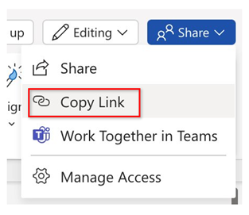

# Introduction

Microsoft 365 Copilot in PowerPoint acts as your presentation assistant, transforming your concepts into impactful slides. With Copilot, you can seamlessly convert written documents into presentation decks, complete with speaker notes and references. Starting a new presentation is as easy as providing an outline or prompt and letting Copilot do the heavy lifting. Beyond creation, Copilot also includes tools to streamline lengthy presentations and offers intuitive commands to refine layouts, adjust text formatting, and synchronize animations.

# Exercise

In the previous exercise, you researched company or product ideas and saved your notes to a document titled Copilot Research.docx.

In this exercise, you'll use Copilot in Word to articulate a comprehensive concept that includes the mission, vision, values, proposed offerings, target audience, and distinctive edge of your proposed company or product. Follow the prompts to have Copilot generate your concept and then refine it based on your input.

To reference the file, use the shared link to Copilot Research.docx.

>[!NOTE]
>In the instructions below, we will provide a sample prompt for each step. While you have the option to copy and paste these prompts, we encourage you to personalize them in your own style.
>If Copilot doesn't give you the desired output initially, refine your prompt.
>Remember to enjoy the proces!


## Task 1:

1. Open the Copilot Research.docx document that you saved to your OneDrive account in the previous exercise. Copy its URL by selecting Share in the upper-right corner and choosing Copy Link from the drop-down menu.



2. Launch Microsoft PowerPoint from your browser or use the desktop application.
3. Open a new blank presentation.
4. In the Copilot pane, select the "Create presentation from file" prompt.
5. Paste the Product Concept.docx link after "Create a presentation from" and select Send.

The full prompt should look like:

```md
Create a presentation from [Link to Product Concept.docx].
```
6. Copilot will begin generating slides based on the Product Concept document, providing an outline along with features like speaker notes, images, slide layouts, and a General sensitivity label.

>[!NOTE]
>Generating slides may take up to two minutes, depending on the document’s complexity and number of slides.

7. Once complete, review the slides and make any adjustments as needed. You can use the Designer tool to refine layouts, add or remove slides, and modify content to align with your presentation objectives. For more prompts, see the section below

##Task 2 More Prompts to Enhance Your Presentation with Copilot

Copilot in PowerPoint offers powerful tools to optimize and enhance presentations. Use these prompts to improve the visual and structural elements of your slides, presenting your content in the most effective way:

- Reorganize for impact: Ask Copilot for guidance on structuring the presentation

```md
What’s the best order to present this information for maximum impact?
```
- Iterate and refine: Use Copilot to suggest specific improvements for engagement:

```md
Give me specific examples from this presentation on how I can improve it for better engagement.
```
- Add new content: Have Copilot add slides to address critical aspects of your concept, such as potential challenges and strategies:

```md
Add 2 slides detailing potential challenges this new product may face, and include a slide that outlines key strategies to mitigate those challenges.
```
Experiment with these prompts to create engaging, polished presentations while learning to iterate and enhance designs with Copilot’s intelligent recommendations.


```
After reviewing the updated version, you may further improve the document by focusing on specific sections, such as:
```md
Improve the summary to make it more concise and impactful.
```
Experimenting with these prompts allows you to refine your content through thoughtful adjustments, ultimately creating more persuasive and impactful content.
